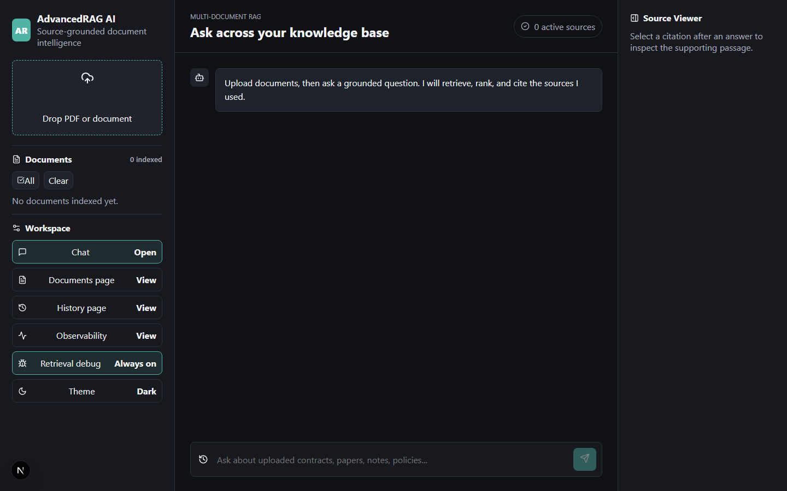
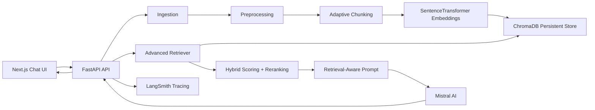

# AdvancedRAG AI

AdvancedRAG AI is a production-style document intelligence platform built with Python, FastAPI, Mistral AI, LangChain, LangSmith, ChromaDB, sentence-transformers, and a modern Next.js frontend. It supports multi-document ingestion, adaptive chunking, persistent semantic retrieval, conversational memory, source-grounded generation, streaming responses, and citation inspection.

## Screenshots



## Architecture



## Features

- PDF, text, markdown, CSV, and document upload pipeline
- Automatic extraction, cleanup, adaptive chunking, and metadata enrichment
- Persistent ChromaDB vector storage with sentence-transformers embeddings
- Semantic similarity retrieval with metadata filters and score thresholds
- Hybrid retrieval through dense search plus lightweight lexical reranking
- Query rewriting for conversation-aware retrieval
- Context budgeting and source-grounded Mistral AI responses
- Streaming Server-Sent Events chat responses
- Conversation memory per session
- Citation-aware answer UI with source viewer
- Debug mode for retrieval diagnostics
- LangSmith tracing hooks, token usage capture, logging, and error handling
- Docker, Render, Railway, and Vercel deployment support

## Tech Stack

Backend: Python, FastAPI, LangChain, LangSmith, Mistral AI, ChromaDB, sentence-transformers, pypdf, Unstructured.

Frontend: Next.js, React, TypeScript, lucide-react, responsive CSS.

Infrastructure: Docker, Docker Compose, Vercel, Render, Railway, environment-based configuration.

## Project Structure

```text
backend/
  app/
    api/routes/          HTTP endpoints
    core/                configuration, logging, errors
    models/              API schemas
    services/            ingestion, chunking, embeddings, vector DB, retrieval, generation
  Dockerfile
  requirements.txt
frontend/
  app/                   Next.js application
  public/
  Dockerfile
  vercel.json
docker-compose.yml
```

## Local Installation

1. Configure backend environment:

```bash
cd backend
cp .env.example .env
```

Set `MISTRAL_API_KEY`. Optionally enable LangSmith with `LANGSMITH_TRACING=true`, `LANGSMITH_API_KEY`, and `LANGSMITH_PROJECT`.

2. Install and run backend:

```bash
python -m venv .venv
source .venv/bin/activate
pip install -r requirements.txt
uvicorn app.main:app --reload --port 8000
```

On Windows PowerShell, activate with:

```powershell
.venv\Scripts\Activate.ps1
```

3. Configure and run frontend:

```bash
cd frontend
cp .env.example .env.local
npm install
npm run dev
```

Open `http://localhost:3000`.

## Docker

```bash
cp backend/.env.example backend/.env
docker compose up --build
```

Frontend runs at `http://localhost:3000`; backend runs at `http://localhost:8000`.

## Deployment

### Backend on Render

Use `backend/render.yaml` as the service blueprint. Add the secrets `MISTRAL_API_KEY` and, if tracing is enabled, `LANGSMITH_API_KEY`.

### Backend on Railway

Use `backend/railway.json`. Set `MISTRAL_API_KEY`, `ALLOWED_ORIGINS`, and persistent storage paths in Railway environment variables.

### Frontend on Vercel

Deploy the `frontend` directory to Vercel. Set:

```text
NEXT_PUBLIC_API_BASE_URL=https://your-backend.example.com/api
```

## API Overview

- `GET /api/health` checks service health
- `POST /api/documents/upload` uploads, chunks, embeds, and indexes a document
- `GET /api/documents` lists indexed documents
- `DELETE /api/documents/{document_id}` removes a document from ChromaDB metadata
- `POST /api/chat` returns a normal JSON answer or an SSE stream
- `GET /api/chat/{session_id}/history` reads conversation memory
- `DELETE /api/chat/{session_id}/history` clears memory
- `GET /api/settings/retriever` shows active retrieval settings

## Production Notes

For a larger deployment, replace file-backed document metadata with Postgres, add object storage for uploads, and run ChromaDB as a managed or dedicated service. Add authentication before exposing private document uploads. For high-volume workloads, move ingestion to a background queue and cache embedding models on startup.

## Future Improvements

- Cross-encoder reranking for higher precision
- Per-tenant auth and workspace permissions
- Background ingestion queue with progress events
- OpenTelemetry-based error monitoring
- Evaluation datasets and automated RAG quality scoring
- Document-level access control and audit trails
- Optional BM25 index for stronger hybrid retrieval

## Portfolio Value

This project demonstrates end-to-end GenAI engineering: document ingestion, retrieval architecture, vector databases, observability, grounded generation, streaming UX, modular backend design, and cloud deployment readiness.
